# AWS_S3_PrivateBucket : Private Bucket Configuration and Security Verification

This project demonstrates the implementation of a secure, private Amazon S3 bucket. It focuses on the "Security by Default" principle, verifying that objects remain inaccessible to the public while remaining manageable via authorized AWS sessions.

## 📌 Project Overview
The objective is to configure a bucket that strictly prohibits public access, document the inevitable "Access Denied" errors when attempting unauthorized entry, and verify secure data storage.

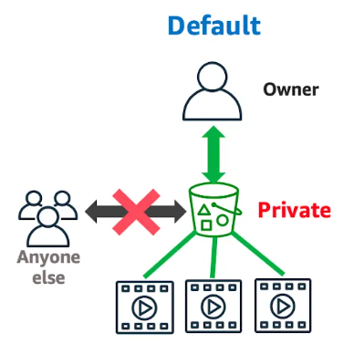

---

## Step-by-Step Implementation

### 1. Initializing the Bucket & Handling Name Conflicts
**Step 1:** Log in to the AWS Management Console and navigate to the S3 Service.
**Step** 2: Click on the "Create bucket" button.
**Step 3:** Enter a Bucket name. Note that if you choose a name already taken by another user globally, AWS will display a red error message: "The specified bucket name is already taken."
**Step 4:** Resolve the conflict by providing a unique name, such as my-private-bucket-1008.
**Step 5:** Select the AWS Region (e.g., Asia Pacific (Osaka) ap-northeast-3).

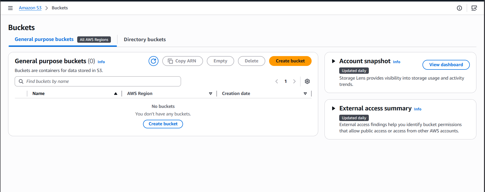

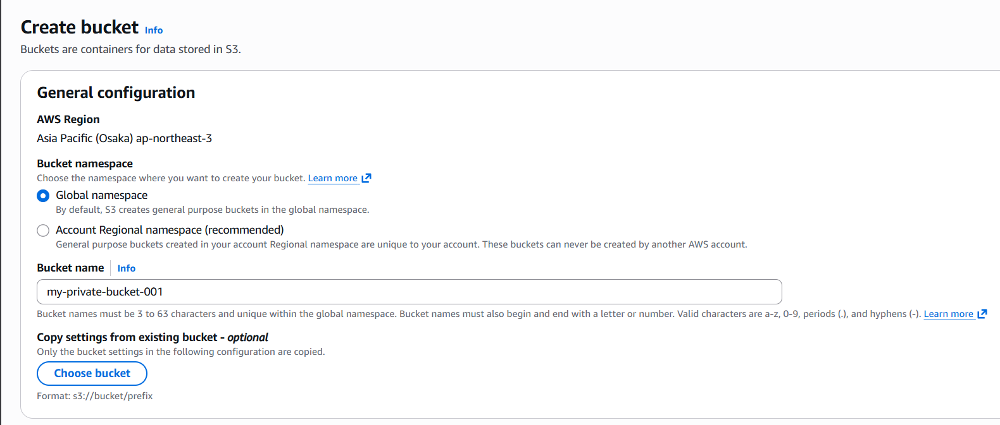

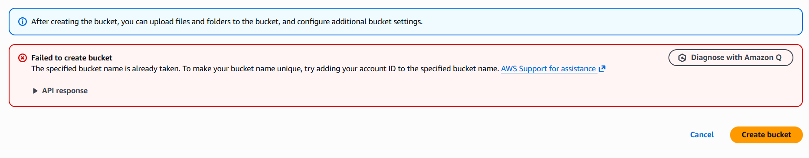

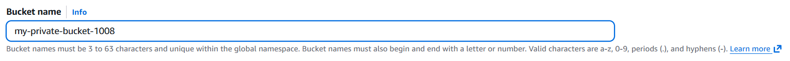

### 2. Configuring Security Settings (Private Access)
**Step 6:** Object Ownership: Select "ACLs disabled (recommended)". This ensures that all objects in the bucket are owned by your account and access is controlled strictly by policies rather than individual file permissions.
**Step 7:** Block Public Access: Ensure the checkbox "Block all public access" is checked. This is the primary security layer that prevents any external entity from viewing your data.

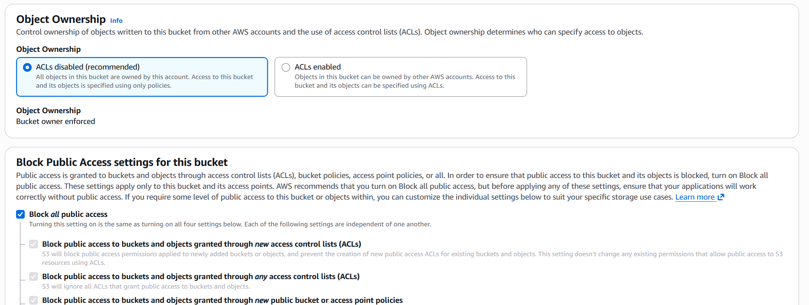

### 3. Setting Durability & Encryption
**Step 8:** Bucket Versioning: For this specific lab, keep it Disabled (or Enable it if you wish to track file changes).
**Step 9:** Default Encryption: Choose "Server-side encryption with Amazon S3 managed keys (SSE-S3)". This ensures your data is encrypted "at rest" on AWS servers.
**Step 10:** Click "Create bucket" at the bottom of the page.

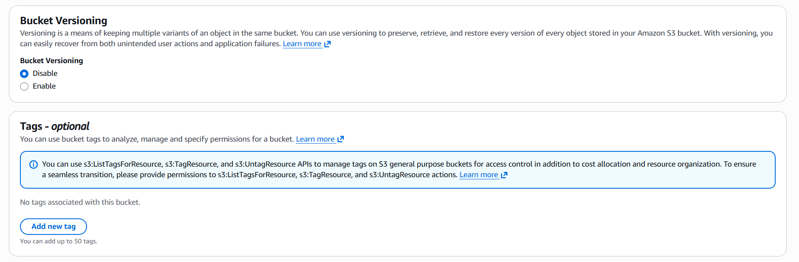

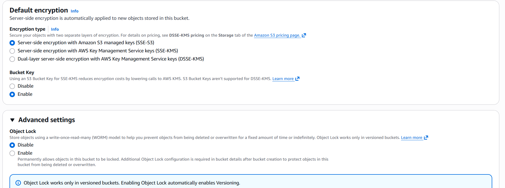

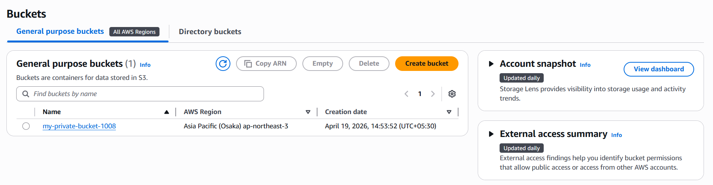

### 4. Object Upload & Verification
**Step 11:** Open your newly created bucket and click "Upload". Select your file (e.g., a system architecture diagram) and click "Upload".
**Step 12:** Once the upload is successful, click on the file name to open the Object Properties.
**Step 13:** Find the Object URL (the public link) and click the copy icon.

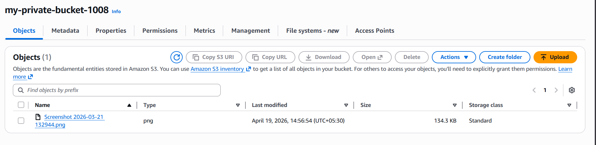

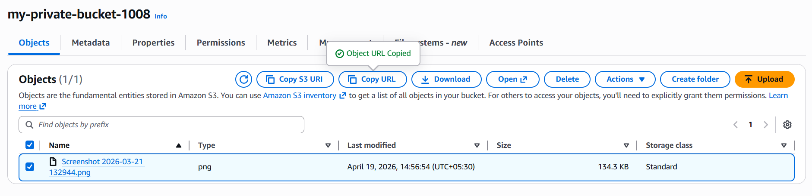

### 5. Testing Security (The "Access Denied" Proof)
**Step 14:** Open a new browser tab or an Incognito window and paste the Object URL.
**Step 15:** Observe the result: The browser should display an XML Error with the code <Code>AccessDenied</Code>.
Conclusion: This proves that even if someone has your file link, they cannot see your data because the bucket is correctly set to Private.

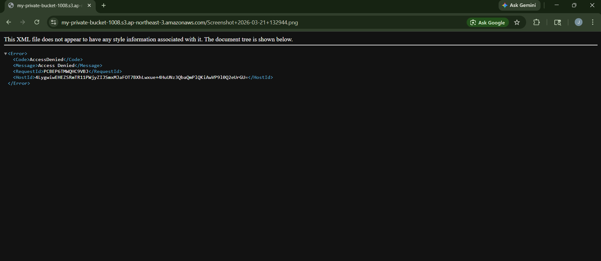

### 6. Authorized Internal Access
**Step 16:** Go back to the AWS Console. Since you are an authorized user, click the "Open" button or the "Download" button.
**Step 17:** You will see that the file opens perfectly for you, as you have the proper IAM permissions to view it.
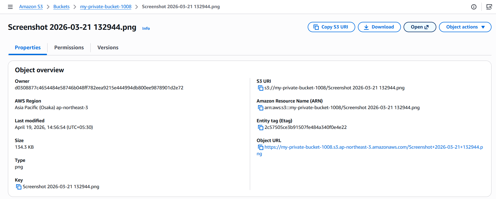

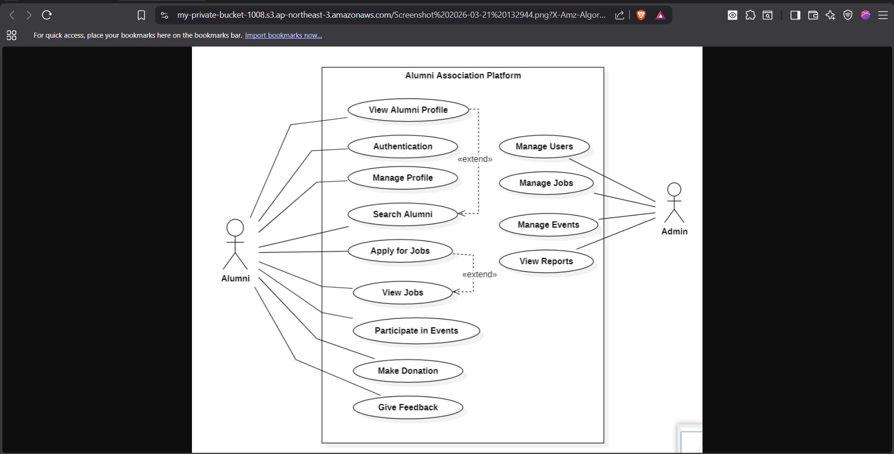

---

## 🔧 Technical Summary
| Feature           | Setting                |
| :---------------- | :--------------------- |
| **AWS Region**    | ap-northeast-3 (Osaka) |
| **Public Access** | **Blocked (All)**      |
| **ACL Status**    | Disabled (Recommended) |
| **Encryption**    | SSE-S3                 |
| **Bucket Policy** | Default Private        |

---

## ⚠️ Common Errors & Troubleshooting

### 1. "Bucket name is already taken"
* **The Error:** You see a red banner saying the name is already in use.
* **The Cause:** S3 names must be unique across all AWS accounts globally.
* **The Fix:** Always use a combination of project names and unique identifiers (like your ID or a random number).
  

### 2. "Access Denied" on Object URL
* **The Insight:** In a private bucket, this is **not** an error—it is the **desired behavior**.
* **The Fix:** If you need to share a private object temporarily, use an **S3 Presigned URL** instead of making the whole bucket public.

---

*This documentation highlights my ability to implement secure cloud storage solutions in an enterprise-ready environment.*

